<!-- Banner local: SVG inline no .md é removido pelo sanitizer do GitHub — precisa ser arquivo + . -->

  

  

  

  
  &nbsp;&nbsp;
  
  &nbsp;&nbsp;
  
  &nbsp;&nbsp;
  

  
  
  
  
  

---

### Sobre

Sou Beatriz Barreto, estudante de Engenharia de Software no iCEV. Meu interesse está na interseção entre código, segurança e inteligência artificial — especialmente quando o objetivo é entender sistemas, proteger informações e aplicar análise com método.

Tenho trajetória em pesquisa acadêmica, com seis artigos publicados, o que reforça meu interesse por rigor técnico, documentação e profundidade nos temas que estudo. No dia a dia, trabalho principalmente com Python e sigo evoluindo de forma consistente em cibersegurança e computação forense.

Fora dos estudos, mantenho curiosidade por temas variados: gosto de explorar assuntos novos, acompanhar documentários e equilibrar isso com desenho, games e outros hobbies.

---

### Terminal

<!-- Regenerar: .venv/bin/termstage render profile.yaml --animated -o terminal-profile.svg -->

  

---

### Em que tenho investido

Temas que concentro estudo e prática quando quero evoluir com consistência:

- Cibersegurança e proteção de sistemas
- Inteligência Artificial aplicada
- Computação forense e análise de evidências digitais
- Automação e desenvolvimento em Python
- Pesquisa acadêmica e produção científica

---

### Pesquisa

Perfil completo no [Google Scholar](https://scholar.google.com.br/citations?user=grYhR5AAAAAJ&hl=pt-BR&oi=ao). Publicações verificadas:

1. **[Piauí mapeado: uma análise descritiva e espacial das mortes violentas intencionais em 2024](https://revistageo.com.br/revista/article/view/1819)** — *Revista Interdisciplinar ReGeo* (Qualis CAPES A2)
2. **[Avisaí: Aplicativo para Melhoria da Comunicação Cidadão-Governo no Registro de Irregularidades Urbanas](https://sol.sbc.org.br/index.php/ercemapi/article/view/41247)** — *ERCEMAPI 2025* · [DOI](https://doi.org/10.5753/ercemapi.2025.17574)
3. **[VisionApp: Reconhecimento Facial em Dispositivos Móveis para Segurança Pública](https://sol.sbc.org.br/index.php/sbesc_estendido/article/view/39481)** — *SBESC 2025* · [DOI](https://doi.org/10.5753/sbesc_estendido.2025.15638)
4. **[Piauí Mapeado: Uma Análise Descritiva e Espacial das Mortes Violentas Intencionais em 2024](https://sol.sbc.org.br/index.php/enucompi/article/view/35667)** — *ENUCOMPI 2025* · [DOI](https://doi.org/10.5753/enucompi.2025.9778)
5. **[Explorando visão computacional e IA para auxiliar indivíduos no Espectro Autista com o reconhecimento de expressões faciais e sentimentos](https://ojs.studiespublicacoes.com.br/ojs/index.php/cadped/article/view/18082)** — *Caderno Pedagógico* · [DOI](https://doi.org/10.54033/cadpedv22n9-151)
6. **[Explorando Visão Computacional e IA para Auxiliar Indivíduos no Espectro Autista com o Reconhecimento de Expressões Faciais e Sentimentos](https://sol.sbc.org.br/index.php/eries/article/view/31600)** — *ERI-ES 2024* · [DOI](https://doi.org/10.5753/eries.2024.243877)

Os trabalhos sobre TEA, segurança pública, análise de dados e comunicação cidadão-governo também aparecem em repositórios como [Detector-de-Emocoes-e-Expressoes-Faciais](https://github.com/whosbea/Detector-de-Emocoes-e-Expressoes-Faciais).

---

### Stack

Organizado por competência.

#### Linguagens

  

  Python &nbsp;·&nbsp; Java &nbsp;·&nbsp; JavaScript &nbsp;·&nbsp; HTML &nbsp;·&nbsp; CSS

#### Ferramentas e entrega

  

  Git &nbsp;·&nbsp; GitHub &nbsp;·&nbsp; GitLab &nbsp;·&nbsp; VS Code

| Competência | Stack |
|:------------|:------|
| Linguagens | Python, Java, JavaScript, HTML, CSS |
| Domínios | Cibersegurança, IA, Computação Forense |
| Ferramentas | Git, GitHub, GitLab, VS Code |
| Pesquisa | 6 publicações · [Google Scholar](https://scholar.google.com.br/citations?user=grYhR5AAAAAJ&hl=pt-BR&oi=ao) |

---

### Atividade

<!-- Mirrors Vercel: mais estáveis no Camo/preview do GitHub. -->

  
  

  

  

  

---

### Contato

  
  &nbsp;&nbsp;
  
  &nbsp;&nbsp;
  
  &nbsp;&nbsp;
  

  Obrigado pela visita.

